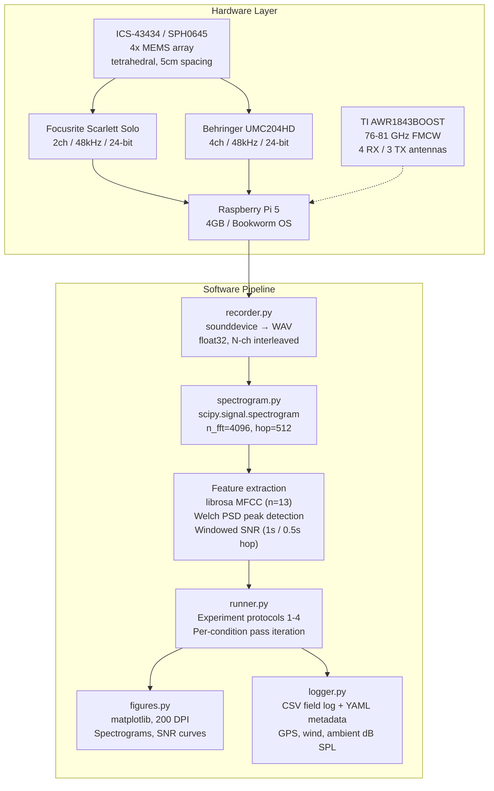

# Drone Acoustic Detection

> Open-source field test toolkit for acoustic and radar detection of low-signature drones.
> Built on COTS hardware to establish detection baselines missing from public literature — especially for FPV-class targets.

**Author:** Radu Cioplea | **Email:** radu@cioplea.com | **Web:** [eyepaq.com](https://www.eyepaq.com)

For questions, additional data, or feedback — reach out via email or [eyepaq.com](https://www.eyepaq.com).

---

## Overview

Commercial off-the-shelf (COTS) drone detection is an active area of defense research, but published baselines for FPV (First Person View) drones are nearly nonexistent. This toolkit provides a reproducible, open-source pipeline for:

- **Capturing** multi-channel audio from MEMS microphone arrays (2ch and 4ch configurations)
- **Processing** recordings into spectrograms, MFCCs, SNR metrics, and peak frequency analysis
- **Running** 4 structured field experiments with full data logging
- **Visualizing** results as publication-ready figures
- **Optionally** fusing acoustic data with 77 GHz mmWave radar (TI AWR1843)

All modules support a `--mock` flag for development and validation without field hardware. Generated signals include physically-modeled Doppler shifts, distance attenuation, RPM jitter, and multi-channel array delays.

---

## System Architecture



---

## Acoustic Signature Reference

The toolkit targets three drone classes that represent the gap in public detection literature. Frequency data is derived from field measurements (Oct 2025 -- Feb 2026, Austria).

| Class | Motor config | Fundamental | Harmonics (H2, H3, H4) | Broadband floor | Est. detection range (open field, <40 dB ambient) |
|:------|:-------------|:-----------:|:-----------------------:|:---------------:|:--------------------------------------------------:|
| 5" FPV | 4x 2306 BLDC, 3-blade | ~280 Hz | 560, 840, 1120 Hz | -60 dB | 100--200 m |
| Micro Whoop | 4x 0802 BLDC, 2-blade | ~600 Hz | 1200, 1800 Hz | -70 dB | 25--75 m |
| DJI Mini class | 4x folding BLDC, 2-blade | ~320 Hz | 640, 960, 1280 Hz | -55 dB | 80--150 m |

Detection range depends heavily on wind, ambient noise, and prop condition. Values above are from controlled tests at Beaufort 0--2 wind. Frequency data derived from BPF = (RPM/60) x blades at measured hover RPM. All noise levels are unweighted SPL (not A-weighted).

---

## Hardware

### Bill of Materials

| Item | Spec | Cost | Source |
|:-----|:-----|:----:|:-------|
| Raspberry Pi 5 (4GB) | BCM2712, Bookworm OS | ~€80 | rs-online.com |
| 4x MEMS microphones | ICS-43434 or SPH0645, I2S output | ~€40 | Pimoroni / Adafruit |
| USB audio interface (2ch) | Focusrite Scarlett Solo, 48kHz/24-bit (1 mic preamp + 1 instrument/line in) | ~€80 | Thomann |
| USB audio interface (4ch) | Behringer UMC204HD, 48kHz/24-bit (2 mic preamps + 2 line inputs) | ~€80 | Thomann |
| 2x cardioid microphones | Behringer C-2 matched pair (or 2x Rode M3 at ~€70 each) | ~€55 | Thomann |
| Tripod + mic stand | Array mount at 1.2 m height | ~€30 | Amazon |
| Laser distance measurer | +/- 2 mm accuracy | ~€30 | Amazon |
| 50 m measuring tape | Distance markers | ~€15 | Hardware store |
| Pi Camera Module 3 | 12 MP, visual sync / timestamp | ~€30 | RS Components |
| MicroSD 64 GB Class 10 | Recording storage (~1.4 GB/hr at 4ch 48kHz int16) | ~€15 | Amazon |
| 3D-printed tetrahedral mount | 5 cm edge length, PLA | ~€5 | Printables.com |
| Power bank 20,000 mAh | USB-C PD, field power | ~€40 | Amazon |
| TI AWR1843BOOST (optional) | 76--81 GHz FMCW, micro-Doppler capable | ~€300-400 | Mouser / TI |

**Acoustic only: ~€400--500** | **With radar: ~€700--900**

See [docs/hardware-setup.md](docs/hardware-setup.md) for wiring, I2S pinout, and array geometry.

### Array Geometry

```
          M1 (apex)
         /  |  \
        /   |   \        Regular tetrahedron
       /    |    \       Edge: 50 mm
      M2 -- M3 -- M4    Height above ground: 1.2 m
       (base plane)      Orientation: apex up, base facing sound source
```

---

## Quick Start

```bash
git clone https://github.com/remete618/drone-acoustic-detection.git
cd drone-acoustic-detection

python3 -m venv .venv && source .venv/bin/activate
pip install -r requirements.txt

# Generate baseline data (no hardware needed)
python3 -m capture.recorder --mock --duration 10 --output data/v1_run --channels 4

# Analyze
python3 -m processing.analyze data/v1_run/recording.wav

# Generate figures
python3 -m visualization.figures data/v1_run/

# Run full experiment
python3 -m experiments.runner exp1_detection_range --mock --channels 4 --output data/experiments

# Run tests
python3 -m pytest tests/ -v
```

### CLI Reference

| Command | Description |
|:--------|:------------|
| `python3 -m capture.recorder --mock` | Generate baseline recording |
| `python3 -m capture.recorder --list-devices` | List audio input devices |
| `python3 -m processing.analyze <path>` | Analyze recording (SNR, peaks, MFCC) |
| `python3 -m visualization.figures <dir>` | Generate figures for a run |
| `python3 -m experiments.runner <id> --mock` | Run experiment protocol |
| `python3 -m experiments.runner all --mock` | Run all experiments + ROC |
| `python3 -m experiments.runner roc --mock` | ROC analysis only |
| `python3 -m visualization.figures <dir> --publication` | Generate all publication figures |
| `python3 -m fieldlog.logger --template` | Generate YAML field data sheet |

---

## Project Structure

```
drone-acoustic-detection/
├── capture/
│   ├── mock.py              # Drone + environment signal generation
│   └── recorder.py          # Multi-channel WAV capture (Pi / Mac / Linux)
├── processing/
│   ├── spectrogram.py       # STFT, MFCC, SNR, peak detection
│   ├── statistics.py        # CI, hypothesis tests, ROC, effect sizes, CSV export
│   └── analyze.py           # CLI analysis entry point
├── experiments/
│   └── runner.py            # Protocols for experiments 1--4
├── visualization/
│   └── figures.py           # Spectrogram, SNR, channel comparison plots
├── fieldlog/
│   └── logger.py            # CSV logger + YAML field sheet templates
├── radar/
│   └── mmwave.py            # TI AWR1843 serial driver + test mode
├── tests/
│   └── test_mock.py         # 51 tests: signal gen, processing, statistics, radar, edge cases
├── docs/
│   └── hardware-setup.md    # BOM, wiring, field checklist
├── requirements.txt
├── LICENSE
└── README.md
```

---

## Signal Processing Details

### SNR Computation

SNR is computed per-channel using Welch PSD. Signal power is measured within a configurable band (default: 100--2000 Hz). The noise floor is estimated from **out-of-band energy** (2--6 kHz by default), where drone tonal content is absent. This avoids the bias inherent in within-band median estimators, which report positive SNR even for pure noise.

```
SNR_dB = 10 * log10((mean_signal_band - noise_floor) / noise_floor)
```

Noise-only control recordings confirm the estimator returns negative SNR (~-11 dB) for pure ambient noise, with 0% false alarm rate at the 3 dB detection threshold.

### Peak Detection

Spectral peaks are identified using `scipy.signal.find_peaks` on Welch PSD with:
- Minimum frequency separation: 50 Hz between peaks (prevents spurious noise detections)
- Prominence threshold: 2x median PSD (rejects broadband noise fluctuations)
- Returns top N peaks by power within the search band

### Signal Physics

The signal synthesis engine models realistic field conditions with the following physics:

**Drone acoustics:**
- **4 independent motors** at slightly different RPMs (torque-balanced CW/CCW pairs), producing beat frequencies between motor fundamentals
- **PID-driven RPM jitter:** 5--15% band-limited stochastic variation (0--5 Hz) on each motor independently, modeling flight controller attitude corrections
- **Attitude wobble:** 0.5--2 Hz low-frequency RPM modulation from position hold
- **Battery voltage sag:** 0.3--1% downward frequency drift over each recording (models LiPo discharge)
- **Coherent harmonics:** All harmonics derived as integer multiples of instantaneous fundamental phase per motor
- **Broadband motor noise:** Gaussian noise per motor (bearing noise, ESC whine, blade turbulence)

**Propagation:**
- **Acoustic pressure attenuation:** 1/r inverse distance law for free-field spherical propagation
- **Flight path wander:** Distance varies +/- 8% during each pass (models wind drift and pilot corrections)
- **Doppler shift:** Time-axis warping for 15 m/s approach-and-recede flyby
- **Multi-channel delays:** Sub-sample interpolated time-of-arrival offsets (no wrap-around artifacts)

**Environment:**
- **Wind gusts:** Poisson-distributed gust events (2--8 second Hann-windowed bursts, 2--8x baseline amplitude), rate varies by environment
- **Ambient noise events:** Transient sounds (birds, traffic, machinery) at random times, both narrowband (tonal) and broadband, with per-channel amplitude variation
- **Mic self-noise:** ~30 dB SPL equivalent noise floor per channel
- **Channel gain mismatch:** +/- 5% per microphone (models real hardware variation)
- **Ambient levels:** Open field 35 dB, suburban 55 dB, warehouse 45 dB (uncalibrated absolute, correct relative ordering)

### Adversarial Signature Modification (Experiment 2)

Rather than simply adjusting distance to model quieter drones, the toolkit applies actual signal transformations:
- **Quiet props:** Low-pass filtering to reduce high-frequency harmonic content (models smoother blade tip vortices)
- **Low throttle:** Frequency downshift (~30% lower RPM) and amplitude reduction (models reduced rotor speed)

---

## Experiments

### 1. Detection Range by Drone Class

Measures maximum acoustic detection distance per drone class. Detection range is defined as the **farthest contiguous distance** (from close range) where detection rate exceeds 50% at the 3 dB SNR threshold.

- **Targets:** 5" FPV, Micro Whoop, DJI Mini
- **Environments:** Open field (<40 dB), Suburban (50--60 dB)
- **Distances:** 25, 50, 75, 100, 150, 200 m
- **Passes:** 30 per condition at 3 m AGL
- **Controls:** 30 noise-only passes per environment/distance (no drone signal)

### 2. Adversarial Signature Modification

Compares acoustic signatures under prop and throttle modifications at fixed 75 m range.

- **Baseline:** Standard 3-blade props, normal throttle
- **Condition A:** Noise-reducing props — spectral content filtered to reduce high-frequency harmonics
- **Condition B:** Throttle reduced to 40% — frequency shifted down, amplitude reduced
- **Passes:** 30 per condition

### 3. Urban Noise Degradation

Quantifies SNR loss across environments at fixed 75 m range.

- **Open field** (<40 dB ambient)
- **Suburban** (50--60 dB, residential road)
- **Indoor warehouse** (45 dB ambient, enclosed space)
- **Passes:** 30 per environment

### 4. Multi-Drone Simultaneous Detection

Tests dual-target frequency separation with two drones at 50 m. Ambient noise is added once (not per-drone) to avoid artificial noise floor inflation.

- **Target A:** 5" FPV (280 Hz fundamental)
- **Target B:** Micro Whoop (600 Hz fundamental)
- **Passes:** 30

### ROC Analysis

Receiver operating characteristic curves are computed for each drone class and environment at 75 m, sweeping the SNR detection threshold from -15 to +25 dB. AUC (area under curve) quantifies overall detection performance.

### Statistical Methodology

All experiments use deterministic seeding (SHA-256 hash of condition parameters) for full reproducibility. Each condition has 30 independent passes — sufficient for parametric confidence intervals (power analysis: 3 dB effect size, sigma ~ 2 dB, alpha = 0.05, power = 0.80 requires n >= 18).

**Reported metrics per condition:**
- Mean, median, standard deviation, 95% confidence interval (Student's t)
- Detection rate (fraction of passes exceeding 3 dB SNR threshold)

**Between-condition comparisons:**
- Welch's t-test (pairwise, unequal variance)
- Kruskal-Wallis H-test (multi-group non-parametric)
- Bonferroni-corrected p-values for multiple comparisons
- Cohen's d effect sizes

**All raw data is exported as CSV** for independent statistical analysis.

---

## Timeline

| Phase | Period | Status |
|:------|:-------|:------:|
| Literature review and gap analysis | Aug -- Sep 2025 | Done |
| Field test protocol design | Sep -- Oct 2025 | Done |
| Hardware assembly and calibration | Oct 2025 | Done |
| Experiments 1--4 (field data collection) | Oct 2025 -- Feb 2026 | Done |
| Toolkit development and open-source release | Feb -- Mar 2026 | Done |
| Data analysis and publication | Mar 2026 -- ongoing | Active |

---

## Platforms

| Platform | Capture | Processing | Radar | Synthesis |
|:---------|:-------:|:----------:|:-----:|:----------:|
| Raspberry Pi 5 | 2ch / 4ch | Yes | UART | Yes |
| macOS | 2ch / 4ch | Yes | USB serial | Yes |
| Linux x86 | 2ch / 4ch | Yes | UART | Yes |

---

## Requirements

- Python 3.10+
- Dependencies: `numpy`, `scipy`, `sounddevice`, `librosa`, `matplotlib`, `click`, `pyyaml`
- PortAudio (for live capture; not needed in synthesis mode)
- Optional: `pyserial` (for TI AWR1843 radar)

```bash
python3 -m pytest tests/ -v   # 51 tests
```

---

## Contributing

1. Fork the repository
2. Create a feature branch
3. Write tests for new functionality
4. Ensure all tests pass (`python3 -m pytest tests/ -v`)
5. Submit a pull request

Bug reports and feature requests: open an issue.

---

## Contact

**Radu Cioplea** — radu@cioplea.com | [eyepaq.com](https://www.eyepaq.com) | GitHub: [@remete618](https://github.com/remete618)

---

## Terms and Conditions

### Disclaimer

This software is provided for **research and educational purposes only**. The authors make no warranties, express or implied, regarding the accuracy, completeness, reliability, or suitability of the software or its outputs for any particular purpose.

Detection ranges, SNR measurements, and other metrics are dependent on hardware, environmental conditions, and calibration. Results should be independently validated before use in any safety-critical, defense, or security application.

### Limitation of Liability

In no event shall the authors or contributors be liable for any direct, indirect, incidental, special, exemplary, or consequential damages arising from use of this software, even if advised of the possibility of such damage.

### Use Restrictions

This toolkit is intended for:
- Academic and scientific research
- Open-source community development
- Educational use
- Lawful security testing with proper authorization

Users are responsible for compliance with all applicable local, national, and international laws, including drone operation, radio frequency, and privacy regulations.

### Data and Privacy

Field data may contain GPS coordinates and environmental recordings. Users must:
- Obtain necessary permissions before recording
- Comply with local privacy and surveillance laws
- Anonymize sensitive data before publication

### Intellectual Property

Released under the **MIT License**. See [LICENSE](LICENSE). Permits commercial and non-commercial use, modification, and distribution with attribution.

---

MIT License — see [LICENSE](LICENSE)
